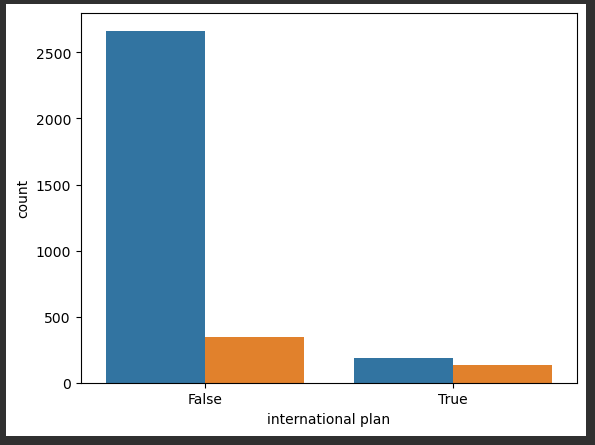
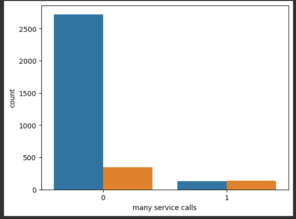

# Exploratory Data Analysis of Telecom dataset

### In this EDA we explore the telecom dataset to find the reason behind churning of customers. While, doing this analysis we will try to find answers for below questions.

* ### what is the proportion of churned users in our dataframe?
* ### How much time (on average) do churned users spend on the phone during daytime?
* ### What is the maximum length of international calls among loyal users (Churn == 0) who do not have an international plan?
* ### give us the values of the rows with index from 0 to 5 (inclusive) and columns labeled from State to Area code (inclusive)
* ### Find out the relation between international plan customers and churning
* ### Find out the relation between number of customer service calls and churning

### From our analysis, below are our findings of churning of customer,
* ### Customer having internation plan are likely to churn out from the telecom service. We could not identify the reason behind the churning out. We need further data of internation calls and customers to analyse.
#### Below shows the plot of international plan users v/s churn. We can see that, most of the internation plan = 'True' have churned out.

* ### Users who have made number of service calls are more likely to churn out. The reason could be unhappy with the service or taking longer time in fixing customer issues. We need further data on customer service calls to root cause the reason behind churning out.
#### Below shows the plot of more service calls v/s churn. We can see that, most of the users who have made more service calls have churned out.

